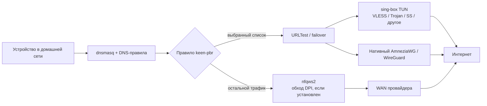

<div align="center">

# keen-pbr-sb

<p align="center">
  
</p>

**Управляемая policy-based маршрутизация для Keenetic: sing-box, нативные VPN, DNS, failover и nfqws2 в одном веб-интерфейсе.**

[](LICENSE)
[](#требования)
[](#поддерживаемые-платформы)
[](https://github.com/SagerNet/sing-box)
[](https://github.com/nfqws/nfqws2-keenetic)
[](https://github.com/maksimkurb/keen-pbr)

[Журнал изменений](CHANGELOG.md) · [Подробная инструкция публикации](docs/PUBLISH_GITHUB.ru.md)

Маршруты по доменам и IP, VLESS/VMess/Trojan/Shadowsocks, WireGuard/AmneziaWG, автоматический failover, DNS Override, соединения и управление nfqws2 — без ручной сборки конфигов из нескольких независимых панелей.

</div>

---

> [!IMPORTANT]
> Это независимый открытый проект. Он не связан с Keenetic или Netcraze и не поддерживается ими официально.

## Зачем это нужно

Оригинальный [keen-pbr](https://github.com/maksimkurb/keen-pbr) умеет направлять выбранный трафик через разные выходы. Этот форк добавляет слой управления транспортами и DNS, чтобы типовой сценарий «список сайтов → нужный туннель → резервный маршрут → корректный DNS» настраивался из одного интерфейса.

Главная идея: **keen-pbr владеет политиками маршрутизации, а конкретные VPN и proxy остаются отдельными транспортами**. Нативные интерфейсы Keenetic можно использовать вместе с sing-box TUN, WireGuard и AmneziaWG. Для нескольких выходов создаётся группа `urltest`, которая автоматически выбирает рабочий маршрут.

## Что внутри

- **Управляемые транспорты sing-box** — импорт `vless://`, `vmess://`, `trojan://`, `ss://`, `hysteria2://`, `tuic://`, `anytls://`, SOCKS и HTTP(S).
- **Произвольный outbound JSON** — интерфейс не ограничивает sing-box только VLESS/Reality.
- **Нативные VPN Keenetic** — существующие WireGuard, AmneziaWG и другие интерфейсы можно привязать к outbound без запуска второго туннеля.
- **Failover через URLTest** — несколько выходов объединяются в резервируемую группу; в карточках транспорта и outbound видна фактическая задержка, а каждый управляемый транспорт можно штатно перезапустить отдельно.
- **Доменные и IP-списки** — локальный текст, URL и бинарные rule-set sing-box `.srs`.
- **Быстрая настройка** — при создании списка можно сразу создать правила маршрутизации и DNS; ручной режим остаётся доступен.
- **DNS Override** — dnsmasq Entware, доменные правила, bootstrap DNS и диагностика запросов с клиентских устройств.
- **Соединения** — активные TCP/UDP-сессии, состояния, адреса, порты, маршрут, имя устройства Keenetic, фильтры и до 1500 последних соединений в оперативной памяти.
- **Импорт и экспорт** — списки и правила маршрутизации; отсутствующие outbounds можно перепривязать при импорте.
- **Встроенный nfqws2** — управление службой, конфигурацией, стратегиями, списками, Lua и журналами из общей панели.
- **11 стратегий nfqws2** — можно применить, изменить, сохранить под своим именем или удалить.
- **Авторизация** — локальная учётная запись и HttpOnly cookie-сессия.
- **Русский установщик и деинсталлятор** — установка и обновление одной командой.
- **Обновление из веб-интерфейса** — заметки GitHub Release, ссылка на полный changelog, проверка SHA256 и защита от отката на более старую версию.

## Как это работает



Трафик, попавший под правило маршрутизации, уходит в выбранный туннель. Весь остальной трафик идёт обычным маршрутом через WAN провайдера, а по пути его обрабатывает nfqws2 — если пакет установлен и служба запущена. Это два независимых механизма: keen-pbr решает, *через какой выход* идти, а nfqws2 модифицирует пакеты, которые идут напрямую, чтобы обойти DPI без туннеля. Поэтому типовая связка выглядит так: важные сервисы — в VPN, а остальное — напрямую с обходом блокировок средствами nfqws2.

sing-box запускается с `auto_route: false`: он создаёт транспортный TUN, но таблицами и правилами маршрутизации управляет keen-pbr. Благодаря этому proxy-туннели и нативные интерфейсы участвуют в одной схеме policy routing.

## Требования

- маршрутизатор Keenetic или Netcraze с установленным Entware в `/opt`;
- доступ по SSH от `root`;
- policy routing и netfilter в прошивке;
- для управляемых proxy-транспортов — sing-box;
- для доменной маршрутизации клиенты должны использовать DNS маршрутизатора.

## Поддерживаемые платформы

Основная собранная и проверяемая цель — Entware `aarch64-3.10`. Исходники предусматривают сборку для `armv7`, `mips`, `mipsel` и `x64`, однако такие пакеты должны собираться и проверяться отдельно.

## Установка одной командой

Подключитесь к роутеру по SSH как `root` и выполните:

```sh
sh -c "$(curl -fsSL https://raw.githubusercontent.com/blindtechnique/keen-pbr-sb/main/install.sh)"
```

Если `curl` отсутствует:

```sh
sh -c "$(wget -qO- https://raw.githubusercontent.com/blindtechnique/keen-pbr-sb/main/install.sh)"
```

Установщик:

1. определит архитектуру Entware;
2. скачает подходящий IPK из последнего GitHub Release;
3. проверит `SHA256SUMS`;
4. предложит найденный sing-box либо установку протестированной версии `1.13.14`;
5. отдельно покажет более новую версию, если она вышла, и предупредит, что совместимость ещё не проверена;
6. предложит настроить авторизацию и Keenetic DNS Override;
7. по желанию подключит официальный репозиторий и установит `nfqws2-keenetic`.

> [!NOTE]
> Повторный запуск той же команды обновляет keen-pbr-sb и сохраняет пользовательскую конфигурацию.

После установки версий с поддержкой OTA обновление также доступно в разделе **Настройки → Обновление keen-pbr-sb**. Перед установкой интерфейс показывает описание GitHub Release и ссылку на полный журнал изменений. Конфигурация, транспорты, авторизация, sing-box и nfqws2 при этом не перенастраиваются.

## Быстрый старт

### Вариант 1. Нативный AmneziaWG или WireGuard

1. Сначала создайте и запустите VPN в штатном интерфейсе Keenetic.
2. Откройте **Транспорты** → **Добавить транспорт**.
3. Выберите **Нативный интерфейс** и укажите имя интерфейса Keenetic.
4. Создайте для него outbound.
5. Создайте список доменов и сразу привяжите правило маршрутизации.

### Вариант 2. VLESS или другой sing-box transport

1. Откройте **Транспорты** → **Добавить транспорт**.
2. Вставьте share-link либо outbound JSON.
3. При необходимости задайте bootstrap DNS IP-адресами, по одному в строке.
4. Запустите транспорт и создайте outbound появившегося TUN-интерфейса.
5. Создайте список и выберите этот outbound в правиле.

### Вариант 3. Автоматический failover

1. Создайте два или больше работающих interface-outbound.
2. Нажмите **Создать failover (URLTest)**.
3. Добавьте нужные outbounds в группу.
4. В правилах маршрутизации выбирайте тег группы, а не отдельного туннеля.

## Форматы подключений

| Формат | Назначение |
|---|---|
| `vless://` | VLESS, включая REALITY |
| `vmess://` | VMess |
| `trojan://` | Trojan |
| `ss://` | Shadowsocks |
| `hysteria2://`, `hy2://` | Hysteria2 |
| `tuic://` | TUIC |
| `anytls://` | AnyTLS |
| `socks://` | SOCKS proxy |
| `http://`, `https://` | HTTP proxy |
| JSON | любой outbound, поддерживаемый установленным sing-box |

## Списки и SRS

Список может содержать домены, суффиксы доменов и IP CIDR либо загружаться по URL. Поддерживаются бинарные rule-set sing-box:

```text
https://raw.githubusercontent.com/SagerNet/sing-geosite/rule-set/geosite-category-ai-!cn.srs
```

keen-pbr-sb загружает `.srs` и вызывает `sing-box rule-set decompile`. Regex, keyword, source CIDR и инвертированные правила пропускаются, поскольку их нельзя без потерь перенести в dnsmasq/ipset.

> [!WARNING]
> DoH/Secure DNS в браузере или отдельный VPN на клиентском устройстве могут обойти DNS-правила маршрутизатора.

## Импорт и экспорт

На страницах **Списки** и **Правила маршрутизации** доступны JSON-экспорт и импорт.

- списки можно заменить полностью или объединить с существующими;
- перед импортом правил проверяются теги outbounds;
- если нужного outbound нет, интерфейс предлагает выбрать существующую замену.

## nfqws2

Установка nfqws2 необязательна. Если пакет не установлен, раздел остаётся в меню и показывает команды установки.

Встроенная страница поддерживает:

- запуск, остановку, restart и reload службы;
- обновление официального пакета;
- структурированное редактирование `nfqws2.conf`;
- выбор и редактирование предустановленных стратегий;
- создание собственных стратегий;
- создание, изменение и удаление `.list` и Lua-файлов;
- импорт и экспорт всех списков одним JSON-файлом;
- просмотр и очистку журналов;
- проверку HTTP-доступности сайта с маршрутизатора.

Сам nfqws2 не встроен в IPK: установщик получает пакет из официального репозитория [nfqws2-keenetic](https://github.com/nfqws/nfqws2-keenetic).

Индикатор службы проверяет не текст init-скрипта, а фактическое наличие процесса nfqws2 и привязанной NFQUEUE 300. Обычный автоопрос страницы пассивен и ничего не перезапускает. Только после явного нажатия restart/stop или применения стратегии интерфейс вызывает официальный init-скрипт; для известной проблемы nfqws2 1.0.2 с пустым PID-файлом PID безопасно восстанавливается, а restart ожидает освобождения очереди перед новым запуском.

## Интерфейс

Веб-интерфейс оформлен в синей палитре KeeneticOS/NDMS с основным цветом `#0086cb`. Общая дизайн-система применяется ко всем страницам: боковой навигации, верхней панели, карточкам, таблицам, формам, диалогам, уведомлениям и состояниям ошибок. Поддерживаются светлая и тёмная темы, сворачиваемое меню и мобильная компоновка. Это визуальная интеграция независимого проекта, а не официальный компонент KeeneticOS.

## Файлы и данные

| Путь | Содержимое |
|---|---|
| `/opt/etc/keen-pbr/config.json` | основная конфигурация |
| `/opt/etc/keen-pbr/transports.json` | управляемые транспорты |
| `/opt/etc/keen-pbr/auth.json` | локальная авторизация веб-интерфейса |
| `/opt/etc/keen-pbr/nfqws-strategies` | пользовательские стратегии nfqws2 |
| `/opt/etc/nfqws2` | конфигурация установленного nfqws2 |
| `/opt/var/cache/keen-pbr` | обновлённые списки и кэш |

## Диагностика

```sh
/opt/etc/init.d/S80keen-pbr status
/opt/etc/init.d/S79transport-manager status
/opt/bin/sing-box version
```

В веб-интерфейсе доступен диагностический отчёт. При проблемах с доменной маршрутизацией сначала проверьте, что клиент использует DNS роутера и не включает собственный DoH.

## Обновление

Запустите установщик повторно:

```sh
sh -c "$(curl -fsSL https://raw.githubusercontent.com/blindtechnique/keen-pbr-sb/main/install.sh)"
```

Конфигурация хранится отдельно от файлов пакета и сохраняется при обновлении.

## Удаление

```sh
sh -c "$(curl -fsSL https://raw.githubusercontent.com/blindtechnique/keen-pbr-sb/main/uninstall.sh)"
```

Деинсталлятор отдельно спросит об удалении конфигурации, установленного проектом sing-box, DNS Override и nfqws2. Entware не удаляется.

## Ограничения

- готовый пакет текущего выпуска предназначен для `aarch64-3.10`;
- новая версия sing-box может потребовать отдельной проверки совместимости;
- имена неизвестных устройств в «Соединениях» отображаются как IP;
- доменная маршрутизация не может управлять DNS, который клиент отправляет мимо роутера;
- это независимый проект без официальной поддержки Keenetic.

## На чём основано

- [maksimkurb/keen-pbr](https://github.com/maksimkurb/keen-pbr) — основа policy-based routing;
- [SagerNet/sing-box](https://github.com/SagerNet/sing-box) — proxy-транспорты и SRS;
- [nfqws/nfqws2-keenetic](https://github.com/nfqws/nfqws2-keenetic) — пакет nfqws2 для Keenetic;
- [nfqws/nfqws-keenetic-web](https://github.com/nfqws/nfqws-keenetic-web) — функции управления, перенесённые в общий интерфейс.

## Публикация и разработка

Исходники находятся в ветке `main`. Готовый IPK и `SHA256SUMS` публикуются как assets отдельного GitHub Release. Каталоги `.cache`, `build`, `frontend/node_modules` и локальные архивы в Git не добавляются.

Инструкция синхронизации с оригинальным keen-pbr находится в `docs/FORK_MAINTENANCE.ru.md`.

## Лицензия

[GPLv3](LICENSE). Исходный код форка, transport-manager, установщик и веб-интерфейс открыты. Сторонние зависимости находятся в `third_party` вместе со своими лицензиями.
