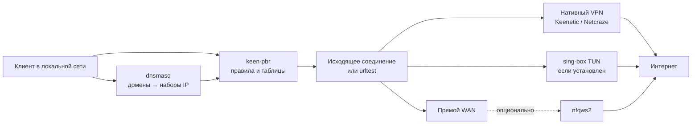

<div align="center">


# keen-pbr-sb

**Выборочная маршрутизация для Keenetic и Netcraze - с нативными VPN, sing-box-транспортами, DNS, резервированием и nfqws2 в одной панели.**

[](LICENSE)
[](#статус-проекта)
[](#требования)
[](#поддерживаемые-платформы)
[](#почему-sing-box-не-управляет-маршрутизацией)
[](#nfqws2)
[](https://github.com/maksimkurb/keen-pbr)

[Установка](#установка) · [Быстрый старт](#быстрый-старт) · [Как это устроено](#как-это-устроено) · [Журнал изменений](CHANGELOG.md)

</div>

> [!IMPORTANT]
> keen-pbr-sb - независимый открытый проект. Он не связан с Keenetic, Netcraze, SagerNet или nfqws и не поддерживается ими официально.

## Статус проекта

keen-pbr-sb выпускается как **beta**. Основные сценарии - нативный WireGuard/AmneziaWG, управляемые sing-box-транспорты, доменные списки, DNS detour, failover, резервное копирование и nfqws2 - уже пригодны для повседневного использования, но сочетаний прошивок, архитектур и сетевых конфигураций значительно больше, чем можно проверить на одном стенде. Перед обновлением сохраняйте резервную копию и сообщайте о воспроизводимых ошибках вместе с диагностическим отчётом.

## Что это

keen-pbr-sb направляет выбранные домены, IP-адреса, устройства и порты через нужное соединение: нативный WireGuard/AmneziaWG из прошивки, OpenVPN, sing-box TUN, резервную группу или обычный WAN. DNS-правила, policy routing и состояние интерфейсов остаются согласованными, а типовой маршрут «список сайтов → туннель → резервный выход → правильный DNS» собирается без ручного редактирования нескольких конфигов.

Проект вырос из [keen-pbr](https://github.com/maksimkurb/keen-pbr) и сохраняет его главное архитектурное решение: маршрутами владеет один специализированный демон. Дополнительные компоненты дают ему интерфейсы и данные, но не конкурируют за `ip rule`, таблицы маршрутизации и firewall.

## Возможности

- Маршрутизация по доменам, IP/CIDR, адресу устройства, протоколу и порту.
- Нативные туннели Keenetic/Netcraze и управляемые TUN-интерфейсы sing-box в одной схеме.
- VLESS, VMess, Trojan, Shadowsocks, Hysteria2, TUIC, AnyTLS, SOCKS и HTTP(S) через share-link или произвольный outbound JSON sing-box.
- `urltest`-группы для автоматического переключения между несколькими соединениями.
- Kill-switch: при падении выбранного туннеля трафик блокируется, а не утекает через WAN.
- Локальные и удалённые списки, каталог готовых подписок, расписание обновления и бинарные rule-set `.srs`.
- Мастер, который вместе со списком создаёт связанные правила маршрутизации и DNS; ручная настройка остаётся доступна.
- DNS Override через dnsmasq Entware, отдельные DNS-серверы, detour и bootstrap DNS.
- Активные соединения, состояния, адреса, порты, домены при наличии DNS-сопоставления, маршрут и имена устройств из NDMS.
- Задержка и фактическое состояние нативных и управляемых туннелей.
- Резервные копии, восстановление и импорт/экспорт основных сущностей.
- Встроенное управление отдельно установленным nfqws2: служба, конфигурация, стратегии, списки, Lua-скрипты, журналы и обновления.
- Локальная авторизация или вход учётной записью роутера; внешний доступ включается отдельно и только при активной защите панели.
- Русские установщик и деинсталлятор, проверка SHA256 и обновление из веб-интерфейса.

## Установка

### Требования

- Keenetic или Netcraze с Entware в `/opt`;
- SSH-доступ от `root`;
- policy routing и netfilter в прошивке;
- клиенты используют DNS роутера, если правила задаются доменами.

sing-box и nfqws2 **не обязательны**. Если маршруты ведут только в нативные VPN-интерфейсы прошивки, keen-pbr-sb работает без них.

### Одна команда

Подключитесь к роутеру по SSH и выполните:

```sh
sh -c "$(curl -fsSL https://raw.githubusercontent.com/blindtechnique/keen-pbr-sb/main/install.sh)"
```

Если `curl` отсутствует:

```sh
sh -c "$(wget -qO- https://raw.githubusercontent.com/blindtechnique/keen-pbr-sb/main/install.sh)"
```

Установщик определит архитектуру, скачает IPK из последнего GitHub Release, сверит `SHA256SUMS` и предложит дополнительные компоненты. Для sing-box по умолчанию используется версия, с которой проверялся выпуск; более новая версия показывается отдельно как непроверенная. nfqws2 устанавливается из его официального репозитория только с согласия пользователя.

Повторный запуск той же команды обновляет пакет, не затирая пользовательскую конфигурацию. После первой установки обновление доступно и в разделе **Настройки → Обновление keen-pbr-sb**.

## Быстрый старт

### Нативный WireGuard или AmneziaWG

1. Создайте и запустите VPN в штатном интерфейсе роутера.
2. В keen-pbr-sb откройте **Транспорты** и добавьте нативный интерфейс.
3. Создайте для него исходящее соединение.
4. Добавьте список доменов или IP и сразу привяжите правило маршрутизации.

### VLESS или другой sing-box-транспорт

1. Установите sing-box через установщик keen-pbr-sb.
2. В разделе **Транспорты** вставьте share-link или outbound JSON.
3. При необходимости укажите bootstrap DNS и страну сервера.
4. Запустите транспорт и создайте исходящее соединение для появившегося TUN.
5. Выберите его при создании списка или правила.

### Резервирование

1. Подготовьте два или больше рабочих исходящих соединения.
2. Создайте группу `urltest` и задайте порядок участников.
3. В правилах выбирайте группу, а не отдельный туннель.

Открытые соединения не переносятся между сетевыми интерфейсами бесшовно: при смене внешнего IP часть TCP-сессий должна установиться заново. Задача `urltest` - быстро выбрать исправный маршрут и не выпустить защищаемый трафик напрямую.

## Как это устроено



### Почему sing-box не управляет маршрутизацией

sing-box здесь используется как **транспорт**, а не как второй маршрутизатор. Он поднимает TUN и устанавливает защищённое соединение с сервером, но запускается с `auto_route: false`. Таблицы, метки, правила и failover остаются у keen-pbr.

Это сделано намеренно:

- нативные VPN прошивки и proxy-туннели участвуют в одних и тех же правилах;
- два компонента не переписывают одновременно `ip rule` и firewall;
- падение или обновление sing-box не разрушает маршруты остальных интерфейсов;
- sing-box можно вообще не устанавливать, если хватает WireGuard, AmneziaWG, OpenVPN или другого нативного туннеля;
- обновление proxy-ядра меньше связано с обновлением самой системы маршрутизации.

Каждый sing-box-транспорт получает отдельный детерминированный TUN-адрес. Адрес сервера исключается из проксируемого маршрута, чтобы туннель не пытался установить сам себя через себя же. Работоспособность оценивается не только по PID: панель учитывает интерфейс, фактический probe и состояние маршрута.

### Почему доменным правилам нужен DNS роутера

В IP-пакете нет имени сайта - там уже находится IP-адрес. dnsmasq видит запрос домена, складывает полученные адреса в набор firewall, а keen-pbr применяет к ним правило. Если устройство использует сторонний DoH или собственный VPN, роутер не видит исходный домен и не может надёжно сопоставить его с соединением.

Принудительный DNS перехватывает обычный порт 53 и может блокировать DNS-over-TLS на 853. Универсально отличить DNS-over-HTTPS от другого HTTPS-трафика на 443 нельзя, поэтому Secure DNS в браузере для строгих доменных правил лучше отключить.

### nfqws2 - отдельный механизм

nfqws2 не является частью маршрутизатора keen-pbr и не встроен в IPK. Он устанавливается официальным пакетом и решает другую задачу: изменяет выбранные пакеты для обхода DPI без обязательного VPN. Веб-панель управляет его файлами и штатным init-скриптом, но keen-pbr не перезапускает nfqws2 во время обычной работы.

## Почему сервис остаётся лёгким

На роутере нет отдельной базы данных и не хранится бесконечная телеметрия. Конфигурация лежит в JSON, списки - в обычных файлах, а история соединений ограничена 1500 записями в памяти. Имена устройств и геоданные кэшируются; страна сервера определяется только по явному выбору пользователя, а результат хранится месяц. Полная GeoIP-база в пакет не включается.

Основной демон написан на C++ и занимается только policy routing, DNS-интеграцией и API. Transport-manager на Go изолирует жизненный цикл управляемых TUN. sing-box и nfqws2 остаются внешними необязательными пакетами - пользователь не платит памятью и местом за функции, которыми не пользуется.

Веб-интерфейс собирается в статические сжатые файлы, разделён по страницам и использует только нужные начертания Roboto в WOFF2. Тяжёлые таблицы отсекают невидимые строки, сетевые снимки и внешние команды имеют лимиты времени и объёма, а часто запрашиваемые данные кратко кэшируются. Это сохраняет отзывчивость панели, не превращая роутер в сервер аналитики.

Стабильность обеспечивается не частотой перезапусков, а ограничением побочных эффектов: конфигурация записывается атомарно, восстановление выполняется транзакционно, перед обновлением создаётся резервная копия, устаревшие PID-файлы проверяются по реальному процессу, а kill-switch закрывает короткое окно между падением туннеля и перестроением маршрута.

## Интерфейс

Навигация, ритм форм, типографика и цветовая система деликатно вдохновлены KeeneticOS/NDMS. Пользователь роутера попадает в знакомую среду и быстрее находит соединения, правила и настройки, при этом keen-pbr-sb остаётся самостоятельной панелью со своей архитектурой и функциональностью.

Есть светлая и тёмная темы, адаптивная мобильная компоновка, массовые действия, перетаскивание правил и понятные состояния длительных операций. Технические имена интерфейсов сохраняются там, где без них нельзя диагностировать маршрут; рядом показываются названия, назначенные в прошивке, и протокол соединения.

## Транспорты и исходящие соединения

Транспорт - то, что физически переносит трафик: нативный VPN-интерфейс или управляемый TUN. Исходящее соединение - логическая цель правила keen-pbr: интерфейс, таблица, блокировка, пропуск или группа `urltest`.

Поддерживаемые share-link:

| Формат | Транспорт |
|---|---|
| `vless://` | VLESS, включая REALITY |
| `vmess://` | VMess |
| `trojan://` | Trojan |
| `ss://` | Shadowsocks |
| `hysteria2://`, `hy2://` | Hysteria2 |
| `tuic://` | TUIC |
| `anytls://` | AnyTLS |
| `socks://` | SOCKS proxy |
| `http://`, `https://` | HTTP proxy |
| JSON | любой outbound, поддерживаемый установленной версией sing-box |

## Списки и `.srs`

Список можно заполнить вручную или загрузить по URL. Поддерживаются домены, IP/CIDR и бинарные rule-set sing-box `.srs`, например:

```text
https://raw.githubusercontent.com/SagerNet/sing-geosite/rule-set/geosite-category-ai-!cn.srs
```

Сейчас `.srs` декомпилируется командой `sing-box rule-set decompile`, поэтому для этого формата нужен установленный sing-box, даже если сам трафик уходит через нативный VPN. Regex, keyword, source CIDR и инвертированные элементы пропускаются: без отдельного rule-set-движка их нельзя без потерь перенести в dnsmasq/ipset.

Файлы Xray `geoip.dat` и `geosite.dat` намеренно не поддерживаются. Это крупные монолитные базы в отдельном protobuf-формате: ради нескольких нужных категорий панели пришлось бы включить ещё один декодер, читать большой архив и извлекать его содержимое на роутере. Такой путь увеличивает пакет, расход памяти и время обновления списков. В угоду предсказуемой нагрузке keen-pbr-sb использует обычные доменные/IP-списки и точечные `.srs`, которые можно подключать отдельно.

## Импорт, экспорт и резервные копии

Экспорт доступен для списков, правил, исходящих соединений, транспортов и файлов nfqws2. При импорте правил отсутствующие теги можно сопоставить с уже существующими соединениями.

Экспорт транспортов содержит share-link, UUID, пароли и другие секреты - интерфейс предупреждает об этом перед загрузкой. Полная резервная копия может включать общие настройки, DNS, транспорты, соединения, списки, правила и nfqws2. Перед обновлением создаётся локальная rollback-копия; её можно дополнительно скачать на компьютер.

## nfqws2

Если nfqws2 не установлен, раздел остаётся в меню и показывает способ установки. После установки доступны:

- запуск, остановка, restart и reload;
- проверка и установка обновлений официального пакета;
- редактирование `nfqws2.conf`, стратегий, `.list` и Lua-файлов, включая `.lua.gz`;
- черновики нескольких файлов с единым применением и перезапуском;
- импорт и экспорт конфигурации и списков;
- журналы и проверка доступности сайта с роутера;
- резервная копия перед обновлением и откат конфигурации.

Состояние определяется по фактическому процессу и активной NFQUEUE, а не по тексту init-скрипта. Обычное открытие страницы ничего не перезапускает.

## Поддерживаемые платформы

Готовый и проверяемый пакет выпуска предназначен для Entware `aarch64-3.10`. Исходники предусматривают сборку для `armv7`, `mips`, `mipsel` и `x64`, но готовность архитектуры означает не только успешную компиляцию: пакет необходимо проверить на реальном роутере, поэтому остальные цели пока не заявлены как поддерживаемые.

По состоянию на **22 июля 2026 года** проект тестировался только на стабильной прошивке **5.1.1**. В этой версии появилась поддержка расширенных параметров ASC для **WireGuard**: их можно передать импортом конфигурационного файла или настроить через интерфейс командной строки роутера.

## Файлы и данные

| Путь | Содержимое |
|---|---|
| `/opt/etc/keen-pbr/config.json` | основная конфигурация |
| `/opt/etc/keen-pbr/transports.json` | управляемые транспорты и секреты подключений |
| `/opt/etc/keen-pbr/auth.json` | локальная авторизация панели |
| `/opt/etc/keen-pbr/nfqws-strategies` | пользовательские стратегии nfqws2 |
| `/opt/etc/nfqws2` | файлы установленного nfqws2 |
| `/opt/var/cache/keen-pbr` | загруженные списки и кэш |
| `/opt/var/log/keen-pbr.log` | журнал, если запись в файл включена |

## Диагностика

```sh
/opt/etc/init.d/S80keen-pbr status
/opt/etc/init.d/S79transport-manager status
/opt/bin/sing-box version
```

В панели доступны журнал, системные проверки и диагностический JSON. Если доменные правила не срабатывают, сначала проверьте DNS клиента, состояние dnsmasq и наличие адресов списка в firewall-наборе. Если туннель поднят, но трафик не идёт, проверьте его задержку, таблицу исходящего соединения и исключение адреса VPN-сервера из самого туннеля.

## Обновление и удаление

Обновление той же командой:

```sh
sh -c "$(curl -fsSL https://raw.githubusercontent.com/blindtechnique/keen-pbr-sb/main/install.sh)"
```

Удаление:

```sh
sh -c "$(curl -fsSL https://raw.githubusercontent.com/blindtechnique/keen-pbr-sb/main/uninstall.sh)"
```

Деинсталлятор отдельно спрашивает об удалении конфигурации, установленного проектом sing-box, DNS Override и nfqws2. Сам Entware не удаляется.

## Ограничения

- текущий готовый пакет проверяется на `aarch64-3.10`;
- новая версия sing-box может потребовать адаптации схемы конфигурации;
- доменное правило не видит DNS, отправленный клиентом мимо роутера;
- страна сервера через внешний геосервис определяется только по явному согласию; её можно выбрать вручную или не показывать;
- домен в истории соединений появляется только при наличии свежего DNS-сопоставления;
- откат обновления восстанавливает конфигурацию, но пока не устанавливает автоматически предыдущий IPK;

## На чём основано

- [maksimkurb/keen-pbr](https://github.com/maksimkurb/keen-pbr) - основа policy-based routing;
- [SagerNet/sing-box](https://github.com/SagerNet/sing-box) - необязательные proxy-транспорты и декомпиляция `.srs`;
- [nfqws/nfqws2-keenetic](https://github.com/nfqws/nfqws2-keenetic) - официальный пакет nfqws2 для Keenetic;
- [nfqws/nfqws-keenetic-web](https://github.com/nfqws/nfqws-keenetic-web) - референс поведения управления nfqws2;
- [hoaxisr/awg-manager](https://github.com/hoaxisr/awg-manager) - каталог готовых списков и практический опыт туннельной панели;
- [Ground-Zerro/HydraRoute](https://github.com/Ground-Zerro/HydraRoute) и [MagiTrickle](https://github.com/MagiTrickle/MagiTrickle) - опыт доменной маршрутизации на маломощных роутерах.

## Лицензия

[GNU General Public License v3.0](LICENSE).
