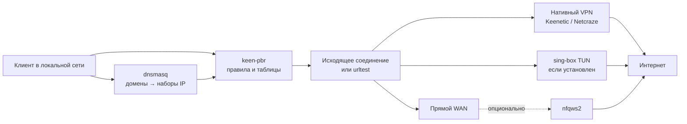

<div align="center">


# keen-pbr-sb

**Выборочная маршрутизация для Keenetic и Netcraze - с нативными VPN, sing-box-транспортами, DNS, резервированием и nfqws2 в одной панели.**

[](LICENSE)
[](#статус-проекта)
[](#требования)
[](#поддерживаемые-платформы)
[](#почему-sing-box-не-управляет-маршрутизацией)
[](#nfqws2)
[](https://github.com/maksimkurb/keen-pbr)

[Установка](#установка) · [Быстрый старт](#быстрый-старт) · [Обновление со stable11](#обновление-с-v307-sb11) · [Как это устроено](#как-это-устроено) · [Журнал изменений](CHANGELOG.md)

</div>

> [!IMPORTANT]
> keen-pbr-sb - независимый открытый проект. Он не связан с Keenetic, Netcraze, SagerNet или nfqws и не поддерживается ими официально.

## Статус проекта

Этот README описывает **Release 12 Beta, версия исходников 3.3.0**, в ветке `main`. Beta — статус выпуска, а не отдельная ветка разработки. Ниже перечислены реализованные возможности; это не обещание поддержки всех сочетаний прошивок, архитектур и сетевых конфигураций.

Release 12 сначала публикуется как **Pre-release (Beta)**, без замены Latest. До продвижения первого выпуска `v3.3.0-sb.12` штатная проверка обновлений со stable11 продолжает видеть прежний Latest `v3.0.7-sb.11`. Проверяйте наличие файлов и статус в [Releases](https://github.com/blindtechnique/keen-pbr-sb/releases), прежде чем выполнять установку.

После приёмки тот же выпуск с теми же файлами можно сделать Latest без пересборки. Тег `v3.3.0-sb.12` совместим со старым обновлятором; версия IPK и панели имеет вид `3.3.0-YYYYMMDDhhmmss` и обозначает конкретную сборку. Канал подписанного манифеста этого кандидата — `stable`; он не означает, что Beta уже прошла приёмку.

Основная платформа — Keenetic/Netcraze с Entware. Перед обновлением скачайте резервную копию и сохраните прежний IPK. Проверка на одной архитектуре не заменяет проверку на вашем устройстве.

## Что это

keen-pbr-sb направляет выбранные домены, IP-адреса, устройства и порты через нужное соединение: нативный WireGuard/AmneziaWG из прошивки, OpenVPN, sing-box TUN, резервную группу или обычный WAN. DNS-правила, policy routing и состояние интерфейсов остаются согласованными, а типовой маршрут «список сайтов → туннель → резервный выход → правильный DNS» собирается без ручного редактирования нескольких конфигов.

Проект вырос из [keen-pbr](https://github.com/maksimkurb/keen-pbr) и сохраняет его главное архитектурное решение: маршрутами владеет один специализированный демон. Дополнительные компоненты дают ему интерфейсы и данные, но не конкурируют за `ip rule`, таблицы маршрутизации и firewall.

## Возможности

- Маршрутизация по доменам, IP/CIDR, адресу устройства, протоколу и порту.
- Нативные туннели Keenetic/Netcraze и управляемые TUN-интерфейсы sing-box в одной схеме; импорт клиентских WireGuard/AmneziaWG из файла или URI Amnezia с предварительным просмотром.
- VLESS, VMess, Trojan, Shadowsocks, Hysteria2, TUIC, AnyTLS, Naive, SOCKS и HTTP(S) через share-link или outbound JSON sing-box.
- Подписки VPN: предварительный просмотр изменений, выбор подключений, ручное и плановое обновление, сохранение источников и привязок.
- `urltest`-группы: выбор по задержке либо по приоритету с возвратом к основному соединению, ступени резервирования и настройка поведения при отказе.
- Kill-switch и явная политика отказа: блокировка защищаемого трафика или выбранный резервный маршрут. Выход через WAN должен быть осознанной частью конфигурации.
- Локальные и удалённые списки, каталог готовых списков, расписание обновления, текст/JSON/YAML и бинарные rule-set `.srs`.
- Мастер, который вместе со списком создаёт связанные правила маршрутизации и DNS; ручная настройка остаётся доступна.
- DNS Override через dnsmasq Entware, отдельные DNS-серверы, detour и bootstrap DNS; настройка DNS клиентов и сигнала автоматического Secure DNS Firefox.
- Активные соединения, ограниченная история, домены при наличии DNS-сопоставления, цепочка маршрута, счётчики правил и имена устройств из NDMS.
- Задержка и фактическое состояние нативных и управляемых туннелей.
- Резервные копии, проверка и восстановление конфигурации, импорт/экспорт основных сущностей и локальные средства восстановления после неудачного обновления.
- Встроенное управление отдельно установленным nfqws2: служба, конфигурация, стратегии, списки, Lua-скрипты, журналы и обновления.
- Локальная авторизация или вход учётной записью роутера; внешний доступ включается отдельно и только при активной защите панели.
- Русский и английский интерфейс, понятные названия соединений, локальные черновики форм и предупреждение о несохранённых изменениях.
- Русские установщик и деинсталлятор; подписанные манифесты обновления и SHA256 пакетов, обновление из веб-интерфейса и прямой путь перехода со stable11.

## Установка

### Требования

- Keenetic или Netcraze с Entware в `/opt`;
- SSH-доступ от `root`;
- policy routing и netfilter в прошивке;
- клиенты используют DNS роутера, если правила задаются доменами.

sing-box и nfqws2 **не обязательны**. Если маршруты ведут только в нативные VPN-интерфейсы прошивки, keen-pbr-sb работает без них.

### Первая установка из Latest

Обычный установщик выбирает **Latest**, а не Pre-release. До продвижения Release 12 эта команда не является способом установить Beta; состояние публикации указано [выше](#статус-проекта). Новый установщик не принимает прежние неподписанные пакеты вместо подписанного выпуска. Для проверки Beta на существующей установке используйте [отдельную инструкцию](#добровольная-проверка-beta-до-latest).

После появления подписанного Latest подключитесь к роутеру по SSH и выполните:

```sh
sh -c "$(curl -fsSL https://raw.githubusercontent.com/blindtechnique/keen-pbr-sb/main/install.sh)"
```

Если `curl` отсутствует:

```sh
sh -c "$(wget -qO- https://raw.githubusercontent.com/blindtechnique/keen-pbr-sb/main/install.sh)"
```

Установщик определит архитектуру, проверит подпись манифеста выпуска и SHA256 выбранного IPK, затем предложит первоначальную настройку и дополнительные компоненты. Зафиксированная версия sing-box для этих исходников — **1.13.14**; уже установленный sing-box можно сохранить. nfqws2 устанавливается из его официального репозитория только с согласия пользователя.

Первая загрузка установщика и доверенного ключа опирается на HTTPS GitHub. В установленных подписанных версиях штатный обновлятор дополнительно проверяет подпись установщика до его запуска. Прямой `opkg install` сам по себе не выполняет эти проверки проекта. Подробности: [подпись выпусков](docs/keenetic-release-signing.md).

Для обновления существующей установки используйте панель или [штатный обновлятор](#обновление-и-удаление), а не повторный запуск мастера первой установки.

## Быстрый старт

### Нативный WireGuard или AmneziaWG

1. Создайте VPN в штатном интерфейсе роутера либо откройте импорт VPN в keen-pbr-sb: доступны клиентские файлы `.conf`/`.vpn` и URI Amnezia `vpn://` с предварительным просмотром.
2. Проверьте, что выбран именно клиентский интерфейс и прошивка поддерживает нужные параметры. Нативный импорт зависит от возможностей KeeneticOS и доступности безопасного управления роутером.
3. При импорте связанный маршрут создаётся автоматически — отдельно создавать исходящее соединение не нужно. Уже существующий интерфейс Keenetic можно подключить к маршрутизации вручную без повторного импорта. Проверьте, что VPN запущен.
4. Добавьте список доменов или IP и привяжите правило к этому соединению. Мастер списка может создать связанные маршрут и DNS-правило.

### VLESS или другой sing-box-транспорт

1. Установите sing-box через установщик keen-pbr-sb.
2. В разделе **VPN и прокси** откройте добавление VPN и вставьте share-link, outbound JSON или адрес подписки. Для подписки сначала выберите нужные подключения в предварительном просмотре.
3. Задайте понятное название и при необходимости bootstrap DNS. Страну можно выбрать вручную; внешний геосервис используется только по вашему действию.
4. Связанное исходящее соединение создаётся при импорте автоматически. Проверьте запуск транспорта. Если панель предлагает исключить адрес сервера из VPN-маршрутизации, проверьте и подтвердите это исключение, чтобы избежать петли.
5. Выберите его при создании списка или правила.

У подписки можно сохранить URL и расписание последующих проверок. Автообновление уже импортированных VPN поддерживает URI/base64-подписки; полный sing-box JSON с `outbounds` пока не поддерживается этим механизмом. Разовый импорт отдельных ссылок не создаёт подписку автоматически. Перед применением обновления проверьте добавляемые, изменяемые и удаляемые подключения.

### Резервирование

1. Подготовьте два или больше рабочих исходящих соединения.
2. Создайте группу `urltest`: выберите минимальную задержку либо приоритет с возвратом к основному, настройте участников и ступени резервирования.
3. Укажите поведение при недоступности всех участников: блокировка или явно выбранный резервный выход. WAN не должен быть резервом, если прямой трафик недопустим.
4. В правилах выбирайте группу, а не отдельный туннель. Проверьте переключение и восстановление на своей сети.

Открытые соединения не переносятся между сетевыми интерфейсами бесшовно: при смене внешнего IP часть TCP-сессий должна установиться заново. Настройка активных соединений при переключении позволяет сохранять их на прежнем маршруте или переподключать при отказе; результат зависит от доступности прежнего выхода и поддержки firewall/conntrack на устройстве.

## Как это устроено


```mermaid
flowchart LR
    CLIENT["Клиент в локальной сети"] --> DNS["dnsmasq\nдомены → наборы IP"]
    CLIENT --> PBR["keen-pbr\nправила и таблицы"]
    DNS --> PBR
    PBR --> GROUP["Исходящее соединение\nили urltest"]
    GROUP --> NATIVE["Нативный VPN\nKeenetic / Netcraze"]
    GROUP --> SBTUN["sing-box TUN\nесли установлен"]
    GROUP --> WAN["Прямой WAN"]
    WAN -. "опционально" .-> NFQ["nfqws2"]
    NATIVE --> NET["Интернет"]
    SBTUN --> NET
    NFQ --> NET
```

### Почему sing-box не управляет маршрутизацией

sing-box здесь используется как **транспорт**, а не как второй маршрутизатор. Он поднимает TUN и устанавливает защищённое соединение с сервером, но запускается с `auto_route: false`. Таблицы, метки, правила и failover остаются у keen-pbr.

Это сделано намеренно:

- нативные VPN прошивки и proxy-туннели участвуют в одних и тех же правилах;
- два компонента не переписывают одновременно `ip rule` и firewall;
- падение или обновление sing-box не разрушает маршруты остальных интерфейсов;
- sing-box можно вообще не устанавливать, если хватает WireGuard, AmneziaWG, OpenVPN или другого нативного туннеля;
- обновление proxy-ядра меньше связано с обновлением самой системы маршрутизации.

Каждый sing-box-транспорт получает отдельный TUN-интерфейс и устойчивое выделение адресов без пересечения с другими управляемыми TUN. Для исключения сервера из VPN-маршрута панель предлагает отдельное подтверждаемое действие: исключение не следует считать автоматически добавленным при любом импорте. Работоспособность оценивается не только по PID: панель учитывает интерфейс, фактическую проверку доступности и состояние маршрута.

Для управляемых sing-box-транспортов доступны два режима процессов. В
изолированном режиме, который остаётся вариантом по умолчанию, каждый прокси
работает в отдельном процессе: это требует больше памяти, зато сбой одного
прокси не затрагивает остальные. В общем режиме один процесс sing-box
обслуживает несколько независимых TUN-интерфейсов и сокращает
накладные расходы на слабом роутере, но становится общей точкой отказа для
этих прокси. Перед переключением панель проверяет объединённую конфигурацию,
дожидается готовности процесса и интерфейсов и при ошибке восстанавливает
предыдущий режим.

### Почему доменным правилам нужен DNS роутера

В IP-пакете нет имени сайта - там уже находится IP-адрес. dnsmasq видит запрос домена, складывает полученные адреса в набор firewall, а keen-pbr применяет к ним правило. Если устройство использует сторонний DoH или собственный VPN, роутер не видит исходный домен и не может надёжно сопоставить его с соединением.

Принудительный DNS перехватывает обычный порт 53 и может блокировать DNS-over-TLS на 853. Универсально отличить DNS-over-HTTPS от другого HTTPS-трафика на 443 нельзя, поэтому Secure DNS в браузере для строгих доменных правил лучше отключить.

### nfqws2 - отдельный механизм

nfqws2 не является частью маршрутизатора keen-pbr и не встроен в IPK. Он устанавливается официальным пакетом и решает другую задачу: изменяет выбранные пакеты для обхода DPI без обязательного VPN. Веб-панель управляет его файлами и штатным init-скриптом, но keen-pbr не перезапускает nfqws2 во время обычной работы.

## Почему сервис остаётся лёгким

На роутере нет отдельной базы данных и не хранится бесконечная телеметрия. Конфигурация лежит в JSON, списки - в обычных файлах, а история соединений ограничена 1500 записями в памяти. Имена устройств и геоданные кэшируются; страна сервера определяется внешним сервисом только по явному действию пользователя. Полная GeoIP-база в пакет не включается.

Основной демон написан на C++ и занимается только policy routing, DNS-интеграцией и API. Transport-manager на Go изолирует жизненный цикл управляемых TUN. sing-box и nfqws2 остаются внешними необязательными пакетами - пользователь не платит памятью и местом за функции, которыми не пользуется.

Веб-интерфейс собирается в статические сжатые файлы, разделён по страницам и использует только нужные начертания Roboto в WOFF2. Тяжёлые таблицы отсекают невидимые строки, сетевые снимки и внешние команды имеют лимиты времени и объёма, а часто запрашиваемые данные кратко кэшируются. Это сохраняет отзывчивость панели, не превращая роутер в сервер аналитики.

Для ограничения побочных эффектов используются атомарные записи конфигурации, проверки перед применением, восстановление после прерванных операций и проверка PID-файлов по реальному процессу. Обновлятор готовит локальную резервную копию; откат пакета требует сохранённого прежнего IPK. Эти меры не заменяют внешнюю копию настроек и проверку политики отказа на конкретном роутере.

## Интерфейс

Навигация, ритм форм, типографика и цветовая система деликатно вдохновлены KeeneticOS/NDMS. Пользователь роутера попадает в знакомую среду и быстрее находит соединения, правила и настройки, при этом keen-pbr-sb остаётся самостоятельной панелью со своей архитектурой и функциональностью.

Есть русский и английский языки, светлая и тёмная темы, адаптивная мобильная компоновка, массовые действия, перетаскивание правил и состояния длительных операций. Обычные формы используют локальный черновик до явного сохранения и предупреждают при закрытии с изменениями. Понятные названия соединений отделены от стабильных технических идентификаторов; имена интерфейсов и протокол остаются доступны для диагностики.

## Транспорты и исходящие соединения

Транспорт - то, что физически переносит трафик: нативный VPN-интерфейс или управляемый TUN. Исходящее соединение - логическая цель правила keen-pbr: интерфейс, таблица, блокировка, пропуск или группа `urltest`.

Поддерживаемые share-link:

| Формат | Транспорт |
|---|---|
| `vless://` | VLESS, включая REALITY |
| `vmess://` | VMess |
| `trojan://` | Trojan |
| `ss://` | Shadowsocks |
| `hysteria2://`, `hy2://` | Hysteria2 |
| `tuic://` | TUIC |
| `anytls://` | AnyTLS |
| `naive+https://`, `naive+quic://`, `naive://` | NaiveProxy |
| `socks://`, `socks5://` | SOCKS proxy |
| `http://`, `https://` | HTTP proxy |
| JSON | любой outbound, поддерживаемый установленной версией sing-box |

Доступность конкретного протокола зависит от установленной сборки sing-box. Для Naive требуется отдельная библиотека: панель предлагает загрузить её из соответствующего выпуска sing-box, она не устанавливается всем пользователям по умолчанию.

Подписки VPN находятся отдельно от списков доменов/IP: первые обновляют подключения, вторые определяют, какой трафик направлять через них. Сохранённый источник подписки, расписание и привязки входят в резервную копию; восстановление архива не запускает скрытую загрузку всех подписок из сети.

## Списки и `.srs`

Список можно заполнить вручную, импортировать из файла или загрузить по URL. Для текстовых данных доступны записи по одной на строку, JSON-массив строк и YAML `payload`; это не импорт произвольной конфигурации другого маршрутизатора. Поддерживаются домены, IP/CIDR и бинарные rule-set `.srs`, например:

```text
https://raw.githubusercontent.com/SagerNet/sing-geosite/rule-set/geosite-category-ai-!cn.srs
```

Версии формата SRS 1-5 декодируются встроенным ядром keen-pbr-sb, поэтому установленный sing-box для таких списков не нужен. Будущая неподдерживаемая версия будет отклонена с понятной ошибкой до обновления keen-pbr-sb: сервис намеренно не запускает внешний декомпилятор над неизвестным форматом. Доменные суффиксы и IP/CIDR переносятся без изменения смысла. Точные SRS-домены получают обычную для списков keen-pbr семантику «сам домен и его поддомены». Регулярные выражения, ключевые слова, инвертированные и зависимые от дополнительных условий правила пропускаются; при таком частичном импорте сервис пишет одно сводное предупреждение в журнал.

Декомпрессия выполняется потоково с отдельными лимитами на сжатый файл, распакованные данные, trie и итоговый список. После обновления декодера кэш автоматически пересобирается, а смена URL никогда не переиспользует ETag предыдущего источника.

Файлы Xray `geoip.dat` и `geosite.dat` намеренно не поддерживаются. Это крупные монолитные базы в отдельном protobuf-формате: ради нескольких нужных категорий панели пришлось бы включить ещё один декодер, читать большой архив и извлекать его содержимое на роутере. Такой путь увеличивает пакет, расход памяти и время обновления списков. В угоду предсказуемой нагрузке keen-pbr-sb использует обычные доменные/IP-списки и точечные `.srs`, которые можно подключать отдельно.

## Импорт, экспорт и резервные копии

Экспорт доступен для списков, правил, исходящих соединений, транспортов и файлов nfqws2. При импорте правил отсутствующие теги можно сопоставить с уже существующими соединениями.

Экспорт транспортов содержит share-link, UUID, пароли и другие секреты - интерфейс предупреждает об этом перед загрузкой. Полная резервная копия может включать общие настройки, DNS, транспорты, подписки VPN, соединения, списки, правила и nfqws2. Храните архив как секрет и скачивайте его на другое устройство перед обновлением.

При восстановлении проверяются формат и зависимости; старые схемы конфигурации мигрируются. Прерванные операции имеют путь восстановления, но локальный rollback не является внешней резервной копией и не гарантирует возврат старого бинарного пакета без сохранённого IPK.

## nfqws2

Если nfqws2 не установлен, раздел остаётся в меню и показывает способ установки. После установки доступны:

- запуск, остановка, restart и reload;
- проверка и установка обновлений официального пакета;
- редактирование `nfqws2.conf`, стратегий, `.list` и Lua-файлов, включая `.lua.gz`;
- черновики нескольких файлов с единым применением и перезапуском;
- импорт и экспорт конфигурации и списков;
- журналы и проверка доступности сайта с роутера;
- резервная копия перед обновлением и откат конфигурации.

Состояние определяется по фактическому процессу и активной NFQUEUE, а не по тексту init-скрипта. Обычное открытие страницы ничего не перезапускает.

## Поддерживаемые платформы

Основной выпуск — Entware IPK для Keenetic/Netcraze. Для Release 12 предусмотрены три профиля: `aarch64-3.10`, `mips-3.4` и `mipsel-3.4`; готовность именно этого выпуска проверяйте в Releases. На реальном роутере пока проверялся только `aarch64-3.10`. Автоматическая проверка формата IPK, комплектации и ELF-архитектуры не заменяет запуск на MIPS: эти профили остаются экспериментальными.

Поддержка нативных WG/AWG-параметров, IPv6 и механизмов firewall зависит от прошивки и модели. Панель проверяет доступные возможности, но единая матрица всех устройств не заявляется. В исходниках также есть сборочная инфраструктура для других Linux-сред, включая OpenWrt и Debian; это не основной сценарий поставки и не обещание той же полноты интеграции, что на Keenetic.

## Файлы и данные

| Путь | Содержимое |
|---|---|
| `/opt/etc/keen-pbr/config.json` | основная конфигурация |
| `/opt/etc/keen-pbr/transports.json` | управляемые транспорты и секреты подключений |
| `/opt/etc/keen-pbr/subscriptions.json` | источники подписок VPN, расписания и привязки |
| `/opt/etc/keen-pbr/auth.json` | локальная авторизация панели |
| `/opt/etc/keen-pbr/nfqws-strategies` | пользовательские стратегии nfqws2 |
| `/opt/etc/nfqws2` | файлы установленного nfqws2 |
| `/opt/var/cache/keen-pbr` | загруженные списки и кэш |
| `/opt/var/log/keen-pbr.log` | журнал, если запись в файл включена |

## Диагностика

```sh
/opt/etc/init.d/S80keen-pbr status
/opt/etc/init.d/S79transport-manager status
/opt/bin/sing-box version
```

В панели доступны журнал, системные проверки, диагностический JSON и состояние фоновых задач: последний результат, длительность, ошибки и следующий плановый запуск. Это ограниченная диагностика, а не постоянная запись всего трафика.

Если доменные правила не срабатывают, сначала проверьте DNS клиента, состояние dnsmasq и наличие адресов списка в firewall-наборе. Если туннель поднят, но трафик не идёт, проверьте его задержку, цепочку маршрута, таблицу исходящего соединения и исключение адреса VPN-сервера из самого туннеля. Перед публикацией отчёта удалите секреты, адреса подписок и другие личные данные.

## Обновление и удаление

Для обычного обновления используйте **Настройки → Обновление keen-pbr-sb** или установленный скрипт по SSH:

```sh
/opt/usr/lib/keen-pbr/self-update.sh
```

Оба способа выбирают Latest и не устанавливают Pre-release автоматически. Сохранённые настройки переносятся без повторного мастера DNS, авторизации и необязательных компонентов. Обновление keen-pbr-sb не означает обновление sing-box или nfqws2.

### Обновление с v3.0.7-sb.11

В Release 12 реализован прямой переход без промежуточного IPK. После продвижения `v3.3.0-sb.12` в Latest старая панель сможет обнаружить совместимый тег и вызвать установщик именно этого выпуска. Если в Entware нет OpenSSL, установщик сначала добавит `openssl-util` и его зависимости из уже настроенного репозитория Entware; при ошибке остановится до установки keen-pbr. Проверка подписей IPK при этом не отключается.

Старая конфигурация проходит миграцию схемы; `config.json` и `transports.json` сохраняются как пользовательские файлы пакета. Тем не менее перед переходом скачайте архив настроек и сохраните прежний IPK. Реальный переход со stable11 — отдельный пункт приёмки выпуска, в том числе для установки без OpenSSL. Технические условия и границы проверки: [переход со stable11](docs/upgrading-stable11.md).

### Добровольная проверка Beta до Latest

Этот путь предназначен только для владельца существующей установки, который осознанно выбрал тестирование Beta и подготовил восстановление. Выполняйте его **после появления Pre-release `v3.3.0-sb.12` с подписанными файлами для вашей архитектуры**. Это не команда первой установки и не рекомендация обновлять рабочий роутер до приёмки.

По SSH от `root` загрузите установщик из точного тега и запустите только обновление:

```sh
(
  set -e
  installer=$(mktemp /tmp/keen-pbr-sb-install.XXXXXX)
  trap 'rm -f "$installer"' EXIT
  curl -fL https://raw.githubusercontent.com/blindtechnique/keen-pbr-sb/v3.3.0-sb.12/install.sh -o "$installer"
  KEEN_PBR_UPDATE_RELEASE_TAG=v3.3.0-sb.12 sh "$installer" --update
)
```

Тег закреплён и для установщика, и для скачиваемого выпуска; ошибка загрузки или подписи останавливает установку. Не подменяйте ссылку на `main/install.sh --update`: изменяемая ветка не фиксирует проверяемую сборку. После обновления проверьте вход в панель, DNS, правила, VPN, группы и подписки; не считайте один успешный запуск доказательством работы всех сценариев.

### Удаление

```sh
sh -c "$(curl -fsSL https://raw.githubusercontent.com/blindtechnique/keen-pbr-sb/main/uninstall.sh)"
```

Деинсталлятор отдельно спрашивает об удалении конфигурации, установленного проектом sing-box, DNS Override и nfqws2. Сам Entware не удаляется.
Для полного удаления используйте именно этот деинсталлятор: прямой `opkg remove keen-pbr` намеренно сохраняет аварийный загрузочный guard на случай, если команда оказалась частью переустановки.

## Ограничения

- на реальном устройстве пока проверен только пакет `aarch64-3.10`; сборки `mips-3.4` и `mipsel-3.4` экспериментальные;
- новая версия sing-box может потребовать адаптации схемы конфигурации;
- доменное правило не видит DNS, отправленный клиентом мимо роутера;
- страна сервера через внешний геосервис определяется только по явному согласию; её можно выбрать вручную или не показывать;
- домен в истории соединений появляется только при наличии свежего DNS-сопоставления;

## На чём основано

- [maksimkurb/keen-pbr](https://github.com/maksimkurb/keen-pbr) - основа policy-based routing;
- [SagerNet/sing-box](https://github.com/SagerNet/sing-box) - необязательные proxy-транспорты и спецификация бинарного формата `.srs`;
- [nfqws/nfqws2-keenetic](https://github.com/nfqws/nfqws2-keenetic) - официальный пакет nfqws2 для Keenetic;
- [nfqws/nfqws-keenetic-web](https://github.com/nfqws/nfqws-keenetic-web) - референс поведения управления nfqws2;
- [hoaxisr/awg-manager](https://github.com/hoaxisr/awg-manager) - каталог готовых списков и практический опыт туннельной панели;
- [Ground-Zerro/HydraRoute](https://github.com/Ground-Zerro/HydraRoute) и [MagiTrickle](https://github.com/MagiTrickle/MagiTrickle) - опыт доменной маршрутизации на маломощных роутерах.

## Лицензия

[GNU General Public License v3.0](LICENSE).
